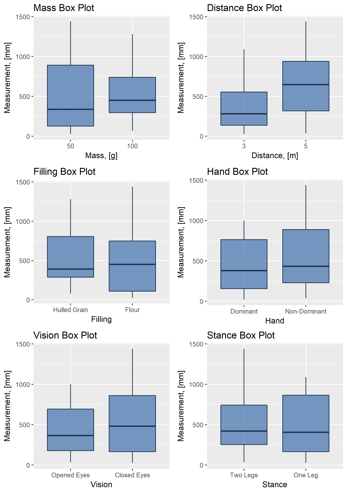

```{r setup, include=FALSE}
# Load libraries
library(knitr)
PACKAGES <- c('FrF2', 'lattice', 'pid', 
              'tidyverse', 'nortest', 'lmtest', 'caret')
lapply(PACKAGES, require, character.only = TRUE)
rm(PACKAGES)
# Set up the working directory
setwd('/Users/sofia/Documents/FJFI/NEX/NEX/NEX2018_08/Project/R')
# Load source files 
source('functions/DataPreparation.R')
source('functions/CreateMultiBoxPlot.R')
source('functions/MapColNames.R')
source('functions/PlotAllInteractions.R')
# Load the dataset
data_all <- loadData(FILE = '../Data/experimental_data.csv')

# Create a data frame with original values

# Separate center points
MAIN_IDX     <- seq(1, 64)
data_noncent <- data_all[MAIN_IDX, ]
data_center  <- data_all[-MAIN_IDX, ]

# Remove unnecessary data and variables from the environment
rm(list = setdiff(ls(), c('data_noncent', 'data_center', 'data_all', lsf.str())))
```

In this assigment we use data set that was collected from an experiment performed by FNSPE CTU students.
The goal of this experiment was to investigate what factors can have possible effect on the students precision while throwing filled rubber balloons. To collect the data, four students were throwing ballons aiming to hit a line. The following factors were taken into consideration: the distance from a testee to the line, a balloon filler, a baloon mass, a hand used to throw a balloon, opened or closed eyes of a testee and testee stance. The dataset consists of 80 observations of 6 categorical variables and responce variable MEASUREMENT. All categorical variables have two levels.

* MASS - a mass of a balloon, "-1" - 50g, "1" - 100g;
* DISTANCE - a distance from the line, "-1" - 3 m, "1" - 5 m;
* FILLING - balloon filling, "-1" - grain, "1" - flour;
* HAND - hand used to throw a balloon, "-1" - dominant, "1" - non-dominant;
* VISION - "-1" - eyes of a testee were opened, "1" - eyes of a testee were closed;
* STANCE - "-1" - a testee stood on two legs, "1" - a testee stood on one leg;
* MEASUREMENT - a distance from a balloon to the line, measured from the furthest part of a ballon from the line, in mm.

Last 16 observations were made with central poits for MASS and DISTANCE, i.e with balloons of the mass 75 g and the distance from the line equal to 4 m.


# Experiment design

Let's denote the first factor MASS by A, the second factor DISTANCE by B, FILLING by C, HAND by D, VISION by E, STANCE by F. Each student performed one of four alternate fractions of one-quarter fraction of the $2^6$ Design. For the first quarter we chose I=ABCE and I=BCDF as the design generators. The complete defining relation in this case is 

\begin{center}
I=ABCE=BCDF=ADEF.
\end{center}

Thus, each effect has three aliases. For example for A we obtain

\begin{center}
A=BCE=ABCDF=DEF
\end{center}

i.e. main effects are aliased by three- and five-factor interactions, two-factor interactions are aliased with each other and with interactions of higher order. Hence our design is a design of resolution IV. There are three alternate fractions of this design, these are fractions with following generating relations

\begin{center}
I=ABCE and I=-BCDF, I=-ABCE and I=BCDF, I=-ABCE and I=-BCDF.
\end{center}


#Basic visual analysis

The Figure on page 2 provides the box plots for all factor variables. A noticeable observation is that only the box plot for the variable DISTANCE indicates remarkable differences in MEASUREMENT with respect to the factor values. On the other hand other variables do not display any visible differences.

```{r, fig.width = 2, echo=FALSE}



```


# Main effects

A One-Way ANOVA tests if the mean value of the response variable differs among two or more levels of a factor. The following table provides a result of the test. The mean value of the response is statistically significantly different only for different distances and there is no statistically significant difference for other factors.

```{r, echo=FALSE}
data_noncent.aov_simple <- aov(measurement ~ ., data = data_noncent)
#summary of the test
summary(data_noncent.aov_simple)
```

The average effect of a factor is defined as the change in response produced by a change in the level of that factor averaged over the levels of the other factors. Let's examine magnitudes and directions of the main effects to determine which factors are likely to be important. The main effects of all factors are plotted in Figure on page 4. The effects of MASS, DISTANCE, HAND and VISION are positive, this suggests that an increase of this factors from the low level to the high level increases the value of the response. The effects of FILLING and STANCE are negative, this suggests that an increase of this factors from the low level to the high level decreases the value of the response variable MEASURMENT. The main effect of all factors appear to be small relative to the main effect of DISTANCE.


#Interactions

The two-factor interactions are plotted in Figures on pages 5-10. Looking at interaction plots for VISION we can note that there is almoust no effect of VISION when MASS is at the high level, while there is lange effect of VISION when MASS is at the low level; the effect of VISION is very large when HAND is at the high level ad very small when HAND is on the low level; the effect of VISION at the high level of STANCE is negative while it is positive at the low level of STANCE. If we look at the interaction plots for STANCE we can see that the effect of STANCE is bigger at the high level of MASS than at the low lever of MASS; the effect of STANCE is positive at the low level of HAND and negative at the high level of HAND and it shows same behaviour at levels of VISION.
It is important to notice, that the effect of DISTANCE is always positive at all levels of other factors.

The normal probability plot of the effects is shown in Figure on page 11. All of the effects that lie along the line are negligible, the large effects are far from the line. The important effects that emerge from this analysis are those that are signed, for instance the effect of the distance, the effect of the interaction of mass, distance, filling, hand and stance. These effects are significant at the 5% significance level. 

We performed the ANOVA test for all possible interactions. The result of the test was that none of the interactions was significant. 


```{r, out.width = "100%", echo=FALSE}


```

```{r, echo=FALSE, include=FALSE}
#Function for plotting and saving all interaction 
#with respect to measurements
#plotAllInteractions(df = data_noncent, 
#                    RESPONSE_NAME = 'measurement', 
#                    OUT_PATH = 'figures/')
                    
```

```{r, out.width = "100%", echo=FALSE}

```
```{r, out.width = "100%", echo=FALSE}

```
```{r, out.width = "100%", echo=FALSE}

```
```{r, out.width = "100%", echo=FALSE}
include_graphics("figures/inter_plot_hand.png")
```
```{r, out.width = "100%", echo=FALSE}

```
```{r, out.width = "100%", echo=FALSE}

```

```{r, echo=FALSE}
#Converting to another format for applying Daniel plot function
data_design <- data2design(data_noncent[, seq(1:6)], quantitative = c(F, F, F, F, F, F))
data_design <- add.response(data_design, data_noncent$measurement)
#class(data_design)
```

```{r, echo=FALSE, include=FALSE}
#Creating Daniel plot that represents significance of some interactions
#Labeled interactions are significant

data_noncent.aov_allint <- aov(measurement ~ mass*distance*filling*hand*vision*stance, 
                               data = data_noncent)
summary(data_noncent.aov_allint)

qqplot(DanielPlot(data_noncent.aov_allint)$x, 
       DanielPlot(data_noncent.aov_allint)$y) 
qqline(DanielPlot(data_noncent.aov_allint)$y)

#Creating Daniel plot with respect to single variables and double interactions
data_noncent.aov_doubleint <- aov(measurement ~ (mass + distance + filling + hand + vision + stance)^2, 
                                  data = data_noncent)
summary(data_noncent.aov_doubleint)
qqplot(DanielPlot(data_noncent.aov_doubleint)$x, 
       DanielPlot(data_noncent.aov_doubleint)$y) 
qqline(DanielPlot(data_noncent.aov_doubleint)$y)

#Plotting Pareto chart that also if specific interactions are significant 
#or not. The higher the values, the more significant interaction is

paretoPlot(data_noncent.aov_allint)
```

```{r, out.width = "100%", echo=FALSE}

```


The following Pareto plot provides magnitudes of effects with their directions.

```{r, out.width = "100%", echo=FALSE}

```


# ANOVA   

Let's create and investigate model with different interaction that were chosen with respect to the results of the analysis above. First we consider a linear model with all interactions that are significant according to normal plot on page 11. We perform the ANOVA test. The result of the test is that only DISTANCE is significant. Also the interaction DISTANCE:STANCE:VISION is close to be significant, thus we include the interaction in the next model.


```{r, echo=FALSE, include=FALSE}


prefinal.aov <- aov(lm(measurement ~ distance + mass:distance:filling:stance + 
                         mass:distance:hand:stance + filling:hand:vision:stance + 
                         mass:distance:filling:vision:stance + distance:hand:stance + 
                         mass:distance:stance + distance:hand:vision:stance + 
                         distance:filling + mass:hand + distance:filling:vision + 
                         hand:stance + vision:stance + distance:vision:stance + 
                         distance:filling:stance - 1, data = data_noncent))

```

```{r, echo=FALSE, include=FALSE}
summary(prefinal.aov)
```
The following table provides ANOVA results for final model.
```{r,echo=FALSE, include=FALSE}

#Final model
final.aov <- aov(lm.default(formula = measurement ~ distance + 
                              distance:stance:vision - 1, data = data_noncent))

```

```{r, echo=FALSE, include=TRUE}
summary(final.aov)
```


#Center points

The following picture is box plots of variables with center points. The box plot "Distance with Center Points" speaks in favour of a linear dependance between DISTANCE and MEASURMENT.

```{r, echo=FALSE, include=FALSE}
#Boxplots of variables with center points

b1 <- createSingleBoxPlot(mapColNames(data_all, "mass"), 1, 7, "Mass, [g]", "Measurement, [mm]",
  "Mass with Center Points",
  PRINT_PLOT = TRUE
)

b2 <- createSingleBoxPlot(mapColNames(data_all, "distance"), 2, 7, "Distance, [m]", "Measurement, [mm]",
  "Distance with Center Points",
  PRINT_PLOT = TRUE
)
plot_final <- grid.arrange(b1, b2, ncol = 2)
ggsave(
  filename = "figures/boxplot_center_points.png",
  plot = plot_final,
  width = 170, height = 115, units = "mm"
)
```

```{r, out.width = "100%", echo=FALSE}

```

We fit a linear model of measurement that depends on mass and distance without intercept, following is the summary for the model and results of ANOVA test.

```{r, , echo=FALSE, include=TRUE}
#Linear model of measurement that depends on mass and distance
#without intercept

center.lm <- lm(measurement ~ mass + distance - 1, data = data_all)
summary(center.lm)
center.aov <- aov(center.lm)
summary(center.aov)
```


#Linear regression 

We fit another linear model
\begin{center}
$\mathbb{E}(MEASURMENT|MASS,DISTANCE)=\beta_1{MASS}+\beta_2{DISTANCE}$,
\end{center}
 where we treat MASS and DISTANCE as numerical variables.

```{r, echo=FALSE, include=FALSE}
#Linear regression with mapping to numeric values
data_all_num <- mapColNames(data_all, c('mass', 'distance'))
data_all_num <- data_all_num %>% 
  mutate(
    mass = as.numeric(as.character(mass)),
    distance = as.numeric(as.character(distance))
  )
```

```{r, echo=FALSE, include=TRUE}
final.lm_num <- lm(measurement ~ mass + distance - 1, data = data_all_num)
summary(final.lm_num)
```


Let's run Lilliefors test and Shapiro-Wilk test to test normality of residuals.


```{r, echo=FALSE, include=TRUE}
#Residual tests to test normality of residuals
lillie.test(residuals(final.lm_num))
shapiro.test(residuals(final.lm_num))
```
 Based on the p-values we reject the null hypothesis about the normality of the residuals.
 
 
The following Figure provides residual plots for the model. Based on those plots, we can talk about the adequacy of the model.

```{r, echo=FALSE, include=TRUE}
#Plotting summary of the linear regression model
par(mfrow = c(2, 2))
plot(final.lm_num)
```
We run the Breusch-Pagan test to detect heteroskedasticity. The following is the result of the test. Based on the p-value we reject the null hypothesis of homoskedasticity and assume heteroskedasticity.
```{r, echo=FALSE, include=TRUE}
#Heteriscedasticity analysis
bptest(final.lm_num)
```
We considere the Box-Cox transformation to possibly improve the model. The following Figure provides residual plots for the transformed model.

```{r, echo=FALSE, include=FALSE}

# Box-Cox transformation
bc_transf <- BoxCoxTrans(data_all_num$measurement)
data_all_num$measurement_bc <- predict(bc_transf, data_all_num$measurement)
```


```{r, echo=FALSE, include=TRUE}
#Plotting summary of the linear regression model
par(mfrow = c(2, 2))
plot(final.lm_num)
```

The summary of the model with transformed response variable:

```{r, echo=FALSE, include=TRUE}
#The FINAL final linear model with Box-Cox transformation
final_bc.lm_num <- lm(measurement_bc ~ mass + distance - 1, data = data_all_num)
summary(final_bc.lm_num)
```

Once again, we performe Lilliefors test and Shapiro-Wilk test to test normality of residuals for the model with transformed response and the Breusch-Pagan test to check heteroskedasticity. Based on the p-values we can not reject the null hypothesis about the normality of the residuals and can not reject the homoskedasticity.

```{r, echo=FALSE, include=TRUE}
# Once again normality tests of residuals
lillie.test(residuals(final_bc.lm_num))
shapiro.test(residuals(final_bc.lm_num))
```

```{r, echo=FALSE, include=TRUE}
#Once again eteriscedasticity analysis
bptest(final_bc.lm_num)
```
The following Figure provides residual plots for the final model with transformed response varible.

```{r, echo=FALSE, include=TRUE}
#Plotting summary of the linear regression model
par(mfrow = c(2, 2))
plot(final_bc.lm_num)
```


#Contour plot

Creating contour plot to show the predictions with repsect to mass and distance values.

```{r, echo=FALSE, include=FALSE}
#Creating contour plot to show the predictions with repsect 
#to mass and distance values

# contourPlot(final.lm_num, N = 25)
new_data <- data.frame(
  'mass'     = seq(40, 110, length.out = 200),
  'distance' = seq(2, 6, length.out = 200)
)

#Creating data grid for predictions
new_data <- expand.grid(new_data)
predictions <- predict(final.lm_num, new_data)
new_data$measurement <- predictions

#Plotting contour plot
contour_plot <- ggplot(new_data, aes(mass, distance, z = measurement)) + 
  geom_raster(aes(fill = measurement)) +
  geom_contour(colour = "white", binwidth = 20) +
  labs(title = 'Contour Plot for Mass and Distance',
       fill = 'Measurement') +
  xlab('Mass') +
  ylab('Distance')
```

```{r, out.width = "100%", echo=FALSE}

```

