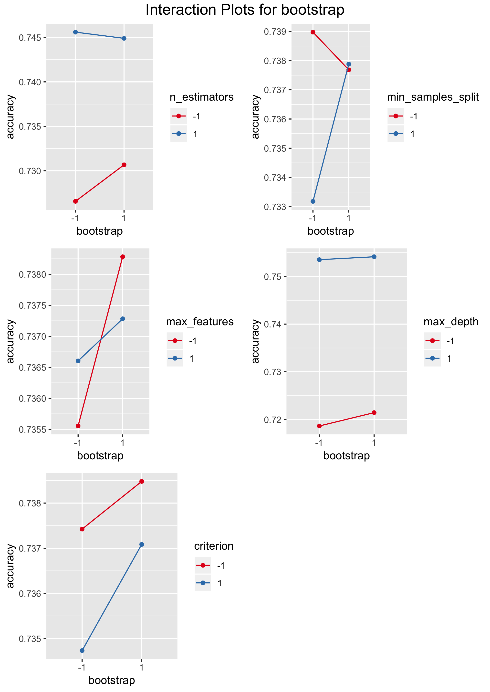
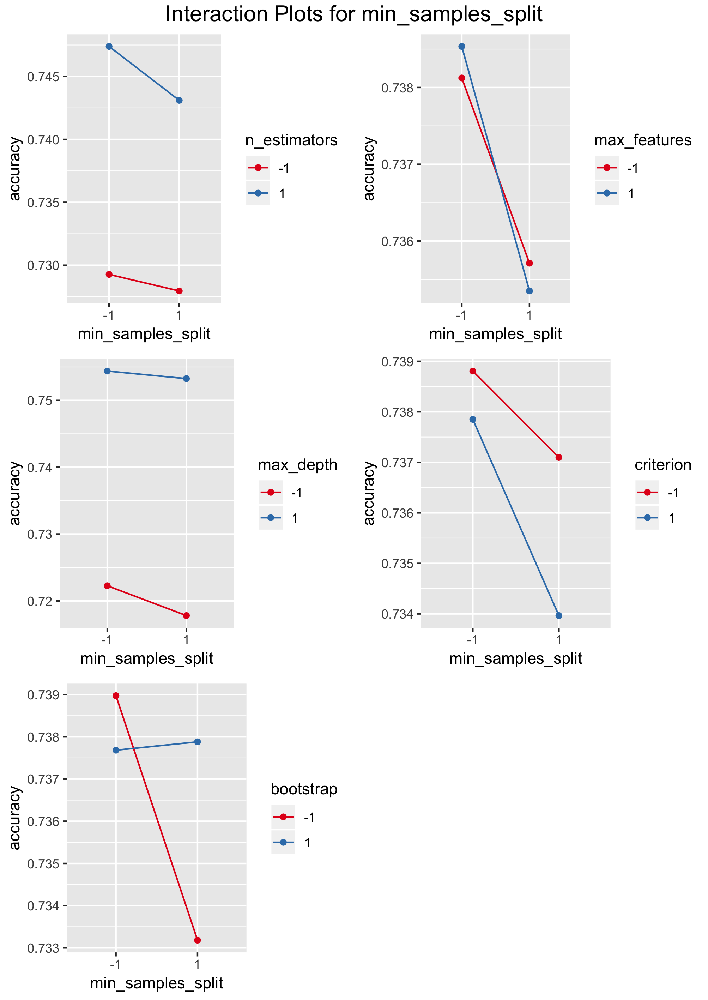
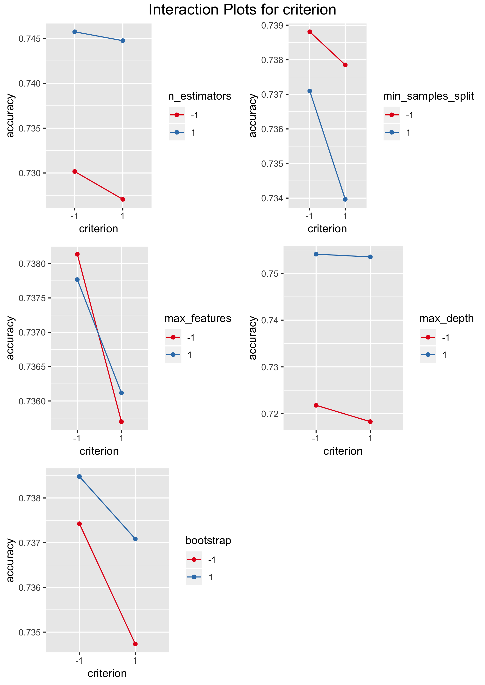

```{r setup, include=FALSE}

# Load packages
PACKAGES <- c(
  "stringr", "knitr", "FrF2", "agricolae", "nortest", "lmtest",
  "caret", "plotly"
)
NEW_PACKAGES <- PACKAGES[!(PACKAGES %in% installed.packages()[, "Package"])]
if (length(NEW_PACKAGES)) install.packages(NEW_PACKAGES)
lapply(PACKAGES, require, character.only = TRUE)
rm(list = c("PACKAGES", "NEW_PACKAGES"))

# Define paths with an assumption that the working directory
# is one step above
PATH_GENERAL <- "../"
PATH_FUNCTIONS <- "R/functions/"
PATH_DATA <- "Data/"
PATH_OUTPUT <- "Output/"


# Load sources
FUNCTIONS_LIST <- lapply(
  c(
    "DataPreparation.R", "CreateMultiBoxPlot.R", "MapValues.R",
    "PlotAllInteractions.R", "Pareto.R", "ToFactor.R"
  ),
  function(x) paste0(PATH_GENERAL, PATH_FUNCTIONS, x)
)
lapply(FUNCTIONS_LIST, source)
rm(FUNCTIONS_LIST)

################################################################################
###############                   Data Loading                   ###############
################################################################################

FILE_NAME <- "design_df_3"
DEP_VAR <- "accuracy"

df <- loadData(
  FILE = paste0(PATH_GENERAL, PATH_DATA, FILE_NAME, ".csv"),
  DEPENDENT_VARIABLE = DEP_VAR
)
df_center <- loadData(
  FILE = paste0(PATH_GENERAL, PATH_DATA, FILE_NAME, "_center", ".csv"),
  DEPENDENT_VARIABLE = DEP_VAR
)
df_all <- rbind(df, df_center)

df_mapped <- toFactor(mapValues(df), DEP_VAR)
df_mapped_center <- toFactor(mapValues(df_center), DEP_VAR)
df_mapped_all <- toFactor(rbind(df_mapped, df_mapped_center), DEP_VAR)

## Load the dataset
fall_data <- read.csv(paste0(PATH_GENERAL, PATH_DATA, 'falldetection.csv'), stringsAsFactors = FALSE)

```

# Project Overview

This small project takes a look at the Fall Detection Data from China. The data 
contains 6 variables: 

* **TIME** - the total time of patient's monitoring;
* **SL** - the level of sugar in the organism;
* **EEG** - electroencephalography monitoring rate;
* **BP** - blood pressure;
* **HR** - heart beat rate;
* **CIRCULATION** - blood circulation.

The response variable **ACTIVITY** classifies the type of activity patients 
were doing during the period of taking measurements of variables presented
above:

| **ACTIVITY** | Type of the Activity |
| :-----: |:--------- | 
| 0      | Standing |
| 1      | Walking  |
| 2      | Sitting  |
| 3      | Falling  |
| 4      | Cramps   |
| 5      | Running  |

Table: Types of Activity

Here is a quick look at the head of the dataset we will be dealing with (it 
contains 16382 rows in total):

```{r echo=FALSE, results='asis'}
kable(fall_data[1:5, ], caption = "Fall Detection Data from China - Sample")
```

In this project we will use the Random Forest classifier to train the machine
to classify activities according to basic inner body measurements. The 
classifier will be trained on a pre-prepaired dataset, as it is going to be 
cleaned and, moreover, all of the explanatory variables will be normalized. 

There will be multiple training sessions depending on the initial parameters of 
the Random Forest model. This set of parameters will be called the grid of
parameters. Each training session on the grid will be divided into $K$ folds (K-fold cross-
validation), and the prediction accuracy will be 
evaluated as the mean accuracy of cross-validation. Aforementioned procedures will provide 
us with a new dataset with the parameter grid as explanatory variables and 
model accuracy as the 
response variable. We will analyze significance of parameters and their 
interactions and look for the most efficient model given their range 
which was present in the grid.

{height="350px"}

The grid of parameters we will be focusing on is the following one:

| **Parameter Name** | Description | Parameter Type | Considered Values |
| :----------------- |:--------------------------------- | :---------: | --------------: |
| `bootstrap` | whether bootstrap samples are used when building trees | *factor* | \{True, False\} |
| `max_depth` | the maximum depth of the tree  | *numeric* | \{10, 40\} |
| `max_features` | the number of features to consider when looking for the best split  | *factor* | \{'sqrt', 'log2'\} |
| `min_samples_split` | the minimum number of samples required to split an internal node | *numeric* | \{4, 20\} |
| `criterion` | the function to measure the quality of a split | *factor* | \{'gini', 'entropy'\} |
| `n_estimators` | the number of trees in the forest | *numeric* | \{10, 500\} | 

Table: Parameters of the Random Forest Classifier

As we are dealing with the $2^6$-factorial design, we will also measure center points for numeric
variables, i.e. model accuracies for 25, 12, 255 of `max_depth`, `min_samples_split` and `n_estimators`, 
respectively.

## Results of the Random Forest Classifier Training

After all training sessions results are as follows:

\pagebreak
```{r echo=FALSE, results='asis'}
kable(df_all, caption = "Random Forest Classifier Accuracy on the Grid")
```

Summary of the generated data set:
```{r echo=FALSE}
summary(df_all)
```

# First Look into the Data

## Visual Analysis

Preliminary analysis via box plot visualization indicates that not all of the variables are significant
for performance of the Random Forest model.[^1] For instance, only `n_estimators` and `max_depth` draw our interest. Regarding the rest of variables, none of them indicate any significance, however, more precise analysis is needed.[^2]

\pagebreak


[^1]: All of the variables were mapped from actual ones to -1, 0 (in case of center points presence), and 1.
[^2]: All tests are performed on the significance level of $\alpha = 5 \%$.

## ANOVA without Interactions 

If we take a closer look into differences between factors, then we discover that actually more variables are of interest to us. Firstly, we perform ANOVA without interactions and see that `min_samples_split` and `criterion` are also quiet important, `bootstrap` is on the margin.

```{r echo=FALSE}
# Simple ANOVA
aov_main.df_mapped <- aov(accuracy ~ ., data = df_mapped)
summary(aov_main.df_mapped)
```

## Tukey's HSD

"Honest Significant Differences" indicates the same fact, as only `max_features` confidence interval includes zero:

```{r echo=FALSE}
# Tukey Honest Significant Differences
tukey <- TukeyHSD(aov_main.df_mapped)
tukey
```

## Main Effects

Looking at the main effects plot and taking into account facts presented above, we can conclude, that `max_depth`, `n_estimators`, `min_samples_split`, `criterion` and `bootstrep` (presented in the order from the highest importance to the lowest) provide us with an explanation of the model accuracy behavior.


# Analysis of Interactions

## Visual Analysis of Interactions

From interaction plots presented below we can empiracally assess the importance of interactions between variables (**X** - important, **-** - not important):

| Variables | `bootstrap` | `max_depth` | `max_features` | `min_samples_split` | `criterion` | `n_estimators` |
| :------------ |:---------: | :---------: | :------------: | :-----------------: | :---------: | :------------: |
| `bootstrap` | *NA* | **-** | **X** | **X** | **-** | **X** |
| `max_depth` | **-** | *NA* | **-** | **-** | **-** | **-** |
| `max_features` | **X** | **-** | *NA* | **X** | **X** | **-** |
| `min_samples_split` | **X** | **-** | **X** | *NA*| **X** | **-** |
| `criterion` | **-** | **-** | **X** | **X** | *NA* | **-** |
| `n_estimators` | **X** | **-** | **-** | **-** | **-** | *NA* |

Table: Empirical Assessment of Pairwise Interactions









