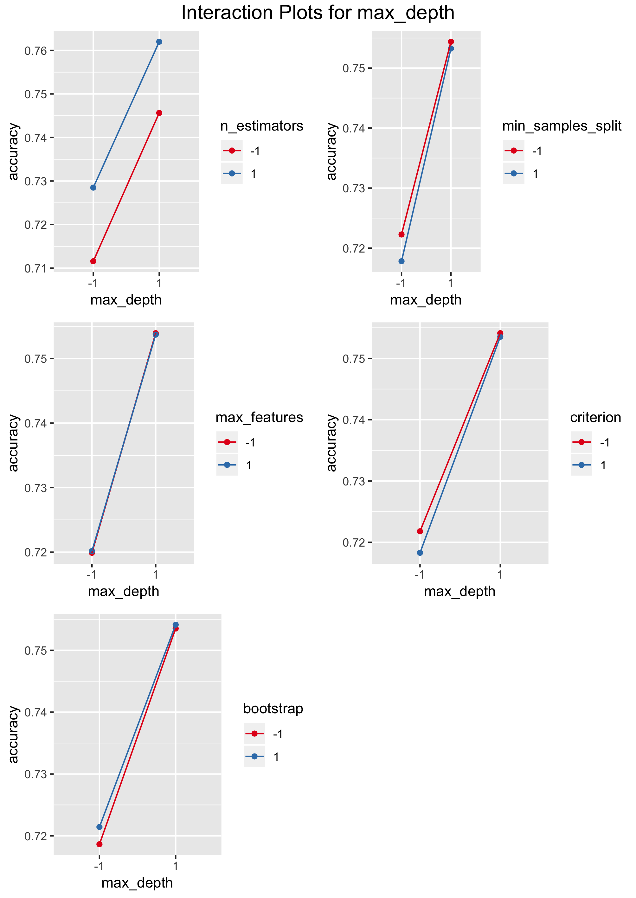
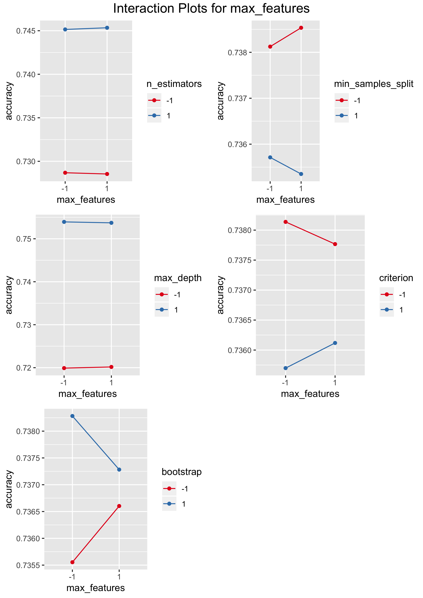
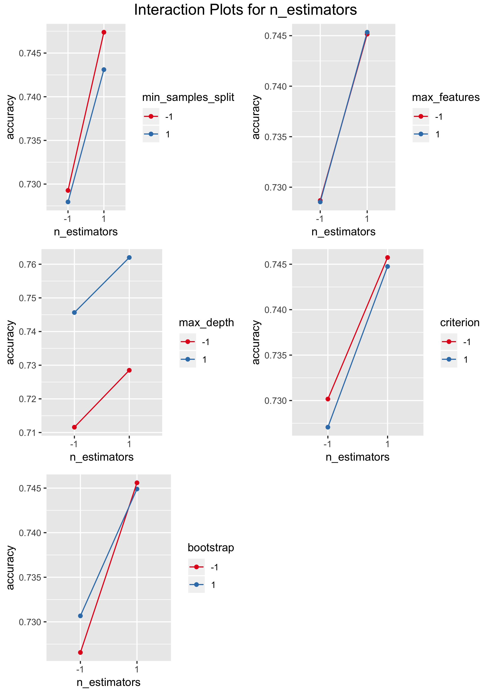

```{r setup, include=FALSE}

# Load packages
PACKAGES <- c(
  "stringr", "knitr", "FrF2", "agricolae", "nortest", "lmtest",
  "caret", "plotly"
)
NEW_PACKAGES <- PACKAGES[!(PACKAGES %in% installed.packages()[, "Package"])]
if (length(NEW_PACKAGES)) install.packages(NEW_PACKAGES)
lapply(PACKAGES, require, character.only = TRUE)
rm(list = c("PACKAGES", "NEW_PACKAGES"))

# Define paths with an assumption that the working directory
# is one step above
PATH_GENERAL <- "../"
PATH_FUNCTIONS <- "R/functions/"
PATH_DATA <- "Data/"
PATH_OUTPUT <- "Output/"


# Load sources
FUNCTIONS_LIST <- lapply(
  c(
    "DataPreparation.R", "CreateMultiBoxPlot.R", "MapValues.R",
    "PlotAllInteractions.R", "Pareto.R", "ToFactor.R"
  ),
  function(x) paste0(PATH_GENERAL, PATH_FUNCTIONS, x)
)
lapply(FUNCTIONS_LIST, source)
rm(FUNCTIONS_LIST)

################################################################################
###############                   Data Loading                   ###############
################################################################################

FILE_NAME <- "design_df_3"
DEP_VAR <- "accuracy"

df <- loadData(
  FILE = paste0(PATH_GENERAL, PATH_DATA, FILE_NAME, ".csv"),
  DEPENDENT_VARIABLE = DEP_VAR
)
df_center <- loadData(
  FILE = paste0(PATH_GENERAL, PATH_DATA, FILE_NAME, "_center", ".csv"),
  DEPENDENT_VARIABLE = DEP_VAR
)
df_all <- rbind(df, df_center)

df_mapped <- toFactor(mapValues(df), DEP_VAR)
df_mapped_center <- toFactor(mapValues(df_center), DEP_VAR)
df_mapped_all <- toFactor(rbind(df_mapped, df_mapped_center), DEP_VAR)

# New data frame just not to mess with the main one
df_fit <- df_all

## Load the dataset
fall_data <- read.csv(paste0(PATH_GENERAL, PATH_DATA, 'falldetection.csv'), stringsAsFactors = FALSE)

```

# Project Overview

This small project takes a look at the Fall Detection Data from China. The data 
contains 6 variables: 

* **TIME** - the total time of patient's monitoring;
* **SL** - the level of sugar in the organism;
* **EEG** - electroencephalography monitoring rate;
* **BP** - blood pressure;
* **HR** - heart beat rate;
* **CIRCULATION** - blood circulation.

The response variable **ACTIVITY** classifies the type of activity patients 
were doing during the period of taking measurements of variables presented
above:

| **ACTIVITY** | Type of the Activity |
| :-----: |:--------- | 
| 0      | Standing |
| 1      | Walking  |
| 2      | Sitting  |
| 3      | Falling  |
| 4      | Cramps   |
| 5      | Running  |

Table: Types of Activity

Here is a quick look at the head of the dataset we will be dealing with (it 
contains 16382 rows in total):

```{r echo=FALSE, results='asis'}
kable(fall_data[1:5, ], caption = "Fall Detection Data from China - Sample")
```

In this project we will use the Random Forest classifier to train the machine
to classify activities according to basic inner body measurements. The 
classifier will be trained on a pre-prepaired dataset, as it is going to be 
cleaned and, moreover, all of the explanatory variables will be normalized. 

There will be multiple training sessions depending on the initial parameters of the Random Forest model. This set of parameters will be called the grid of parameters. Each training session on the grid will be divided into $K$ folds (K-fold cross-validation), and the prediction accuracy will be evaluated as the mean accuracy of cross-validation. Aforementioned procedures will provide us with a new dataset with the parameter grid as explanatory variables and model accuracy as the response variable. We will analyze significance of different effects and their interactions and attempt to fit model accuracy.

{height="350px"}

The grid of parameters we will be focusing on is the following one:

| **Parameter Name** | Description | Parameter Type | Considered Values |
| :----------------- |:--------------------------------- | :---------: | --------------: |
| `bootstrap` | whether bootstrap samples are used when building trees | *factor* | \{True, False\} |
| `max_depth` | the maximum depth of the tree  | *numeric* | \{10, 40\} |
| `max_features` | the number of features to consider when looking for the best split  | *factor* | \{'sqrt', 'log2'\} |
| `min_samples_split` | the minimum number of samples required to split an internal node | *numeric* | \{4, 20\} |
| `criterion` | the function to measure the quality of a split | *factor* | \{'gini', 'entropy'\} |
| `n_estimators` | the number of trees in the forest | *numeric* | \{10, 500\} | 

Table: Parameters of the Random Forest Classifier

As we are dealing with the $2^6$-factorial design, we will also measure center points for numeric
variables, i.e. model accuracies for 25, 12, 255 of `max_depth`, `min_samples_split` and `n_estimators`, 
respectively.

## Results of the Random Forest Classifier Training

After all training sessions results are as follows:

\pagebreak
```{r echo=FALSE, results='asis'}
kable(df_all, caption = "Random Forest Classifier Accuracy on the Grid")
```

Summary of the generated data set:
```{r echo=FALSE}
summary(df_all)
```

# First Look into the Data

## Visual Analysis

Preliminary analysis via box plot visualization indicates that not all of the variables are significant
for performance of the Random Forest model.[^1] For instance, only `n_estimators` and `max_depth` draw our interest. Regarding the rest of variables, none of them indicate any significance, however, more precise analysis is needed.[^2]

\pagebreak


[^1]: All of the variables were mapped from actual ones to -1, 0 (in case of center points presence), and 1.
[^2]: All tests will be performed on the significance level of $\alpha = 5 \%$.

## ANOVA without Interactions 

If we take a closer look into differences between factors, then we discover that actually more variables are of interest to us. Firstly, we perform ANOVA without interactions and see that `min_samples_split` and `criterion` are also quiet important, `bootstrap` is on the margin.

```{r echo=FALSE}
# Simple ANOVA
aov_main.df_mapped <- aov(accuracy ~ ., data = df_mapped)
summary(aov_main.df_mapped)
```

## Tukey's HSD

"Honest Significant Differences" indicates the same fact, as only `max_features` confidence interval includes zero:

```{r echo=FALSE}
# Tukey Honest Significant Differences
tukey <- TukeyHSD(aov_main.df_mapped)
tukey
```

## Main Effects

Looking at the main effects plot and taking into account facts presented above, we can conclude, that `max_depth`, `n_estimators`, `min_samples_split`, `criterion` and `bootstrep` (presented in the order from the highest importance to the lowest) provide us with an explanation of the model accuracy behavior.


# Analysis of Interactions

## Visual Analysis of  Double Interactions

From interaction plots presented below we can empiracally assess the importance of interactions between variables ("**X**" - important, "**-**" - not important):[^3]

| Variables | `A` | `B` | `C` | `D` | `E` | `F` |
| :---------- |:-----: | :-----: | :-----: | :-----: | :-----: | :-----: |
| `A` | *NA* | **-** | **X** | **X** | **-** | **X** |
| `B` | **-** | *NA* | **-** | **-** | **-** | **-** |
| `C` | **X** | **-** | *NA* | **X** | **X** | **-** |
| `D` | **X** | **-** | **X** | *NA*| **X** | **-** |
| `E` | **-** | **-** | **X** | **X** | *NA* | **-** |
| `F` | **X** | **-** | **-** | **-** | **-** | *NA* |

Table: Empirical Assessment of Pairwise Interactions

[^3]: For the reason of taking less space on the page here we introduce the following notation: `A` - `bootstrap`, `B` - `max_depth`, `C` - `max_features`, `D` - `min_samples_split`, `E` - `criterion`, `F` - `n_estimators`.


\


\


\


\


\


\


## Daniel Plot

Daniel plot investigates variable signigicance with an assumption that main effects and interactions have Gaussian distribution with constant variance. Non-null effects then look like outliers on the normal plot. In figures presented below only significant effects have names near their the markers.


\


\


## Pareto Plot

Pareto plot is another instrument which aids us in the investigation of effects. The most significant ones are obviously those with the highest magnitude.


\


\


## ANOVA with Double Interactions

From the visual analysis given by three previous paragraphs it is arguably clear that none of higher interactions than double ones are significant enough for sufficient explanation of `accuracy` of the Random Forest classifier. Therefore, we also perform ANOVA with double interactions: 

```{r echo=FALSE}
# ANOVA with double interactions
aov_doubleint.df_mapped <- aov(accuracy ~ (.)^2, data = df_mapped)
summary(aov_doubleint.df_mapped)
```

In conclusion, interaction analysis enables us to construct ANOVA with double interactions containing only significant effects:

```{r echo=FALSE}
# Final ANOVA according to previous interaction analysis
aov_final.df_mapped <- aov(
  accuracy ~ max_depth + n_estimators + min_samples_split:bootstrap +
    min_samples_split + n_estimators:bootstrap + criterion +
    min_samples_split:max_depth + n_estimators:min_samples_split +
    max_depth:criterion,
  data = df_mapped
)
summary(aov_final.df_mapped)
```


# Center Points

Up to this point we used $2^6$ factorial design and tried to determine significant effects on model `accuracy` using linear fits. Now center points for numeric variables are introduced to determine whether any curvature with respect to the response variable is present. Firstly we take a look at box plots:

&nbsp;

{height="600px"}
\

Box plots indicate that curvature is present to some extent. Nonetheless, if a linear model without an intercept is built for the whole data set (original $2^6$-factorial design with added center points), one can see that factors `n_estimators`, `max_depth`, `min_samples_split` are still essential even as linear terms. 


```{r echo=FALSE}
# Linear model for the factorial design with center points
lm.center <- lm(accuracy ~ -1 + n_estimators +
  min_samples_split +
  max_depth, data = df_all)
summary(lm.center)
```


\pagebreak

# Linear Regression


## Pure Linear Fit

Finally, we perform a linear fit for our design data with center points.

```{r echo=FALSE}
# lm.center with numerical variables
lm.center <- lm(accuracy ~ -1 + n_estimators +
                  min_samples_split +
                  max_depth, data = df_fit)
summary(lm.center)
```


{height="425px"}
\

We also note that residuals of this linear model are normally distributed and Breusch-Pagan test against heteroskedasticity enables us to accept the null hypothesis.

```{r echo=FALSE}
# Residual tests to test normality of residuals
lillie.test(residuals(lm.center))
shapiro.test(residuals(lm.center))

# Heteriscedasticity analysis
bptest(lm.center)
```


## Empirical Fit with a Linear Model

Then we construct a linear model with explicit functional dependence 

$$\log(Y) = \beta_1 (X_1 - median(X1))^2 + \beta_2 (X_2 - median(X_2))^3$$

where $Y \equiv$ `accuracy`, $X_1 \equiv$ `n_estimators`and $X_2 \equiv$ `max_depth`. The model formula is deduced empirically from box plots displaying center points. One can easily notice that the R-squared statistic has improved in comparion to the previous model. However, for this model, residuals are clearly not normally distributed and Breusch-Pagan test against heteroskedasticity rejects the null hypothesis.

```{r echo=FALSE}
# Fitting the linear model
lm.numeric_empirical <-
  lm(log(accuracy) ~  -1 + I((n_estimators - median(n_estimators))^2) +
    I((max_depth - median(max_depth))^3), data = df_fit)
summary(lm.numeric_empirical)
```


{height="425px"}
\


## Polynomial Fit

Lastly we perform a fit with orthogonal polynomials given only available data. This model surpasses the first one in terms of R-squared statistic. Moreover, it passes the test of residuals normality and accepts the null hypothesis of Breusch-Pagan test.

```{r echo=FALSE}
# Polynomial fit
lm.numeric <-
  lm(accuracy ~ poly(n_estimators, 1) +
    poly(max_depth, 2), data = df_fit)
summary(lm.numeric)
```

Tests results:

```{r echo=FALSE}
# Residual tests to test normality of residuals
lillie.test(residuals(lm.numeric))
shapiro.test(residuals(lm.numeric))

# Heteriscedasticity analysis
bptest(lm.numeric)
```


{height="425px"}
\

Finally we choose this model to fit `accuracy` of the Random Forest classifier. Here we also present a 3D visualization of this fit:


\


# Conclusion

The polynomial fit we chose has provided us with arguably best parameters for `n_estimators` and `max_depth`. This report is conlcluded with results of the small grid search with `n_estimators` = 314, `max_depth` =  45: with `min_samples_split` = 4, `max_features` = "sqrt", `criterion` = "gini", `bootstrap` = True we obtain `accuracy` equal to 0.7691845. Computed accuracy is higher than that of our prior grid search, so this project was not done for nothing and has "beared its fruit".
